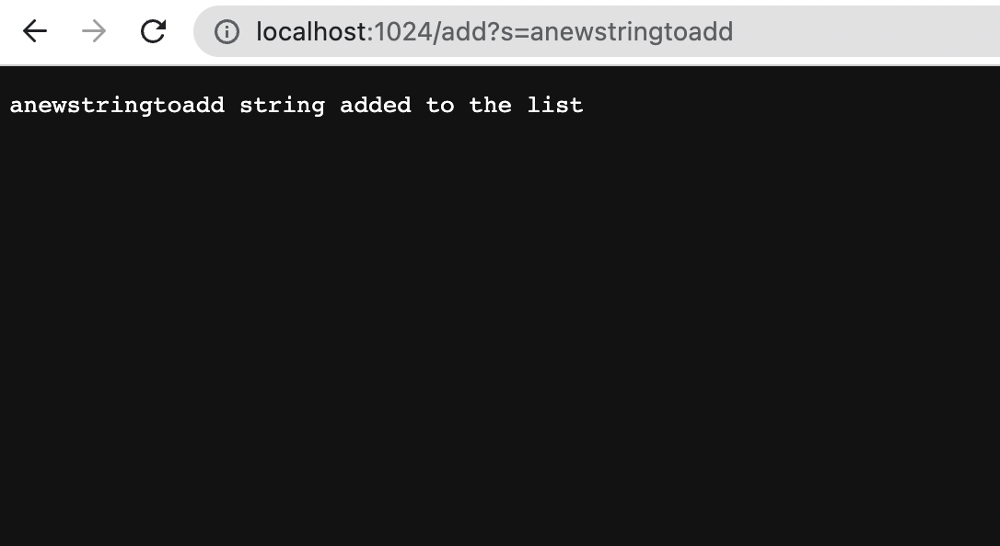
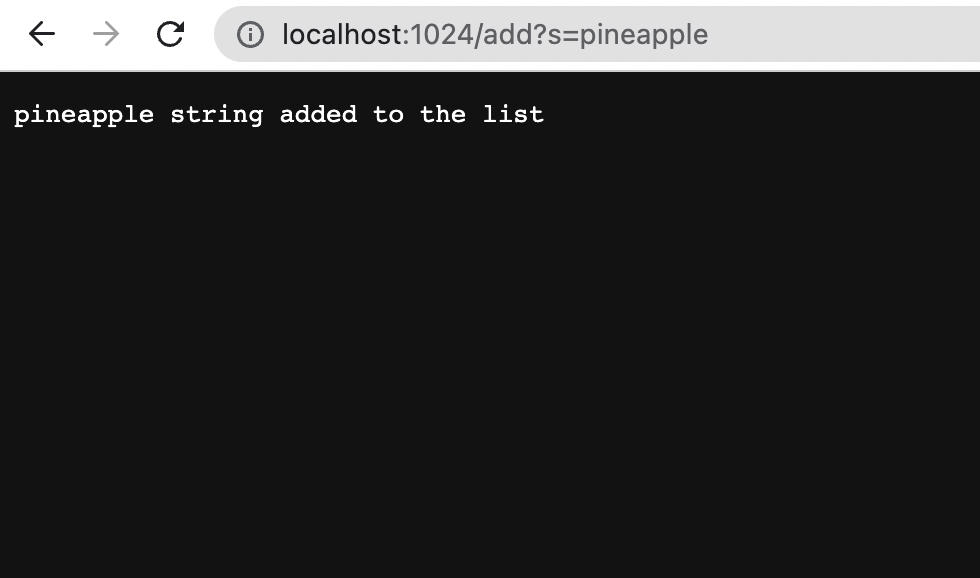

# Lab Report 2
### 10/14/22
### Gunju Kim


## Part 1. Simplest Search Engine
### Server.java
```
import java.io.IOException;
import java.io.OutputStream;
import java.net.InetSocketAddress;
import java.net.URI;

import com.sun.net.httpserver.HttpExchange;
import com.sun.net.httpserver.HttpHandler;
import com.sun.net.httpserver.HttpServer;

interface URLHandler {
    String handleRequest(URI url);
}

class ServerHttpHandler implements HttpHandler {
    URLHandler handler;
    ServerHttpHandler(URLHandler handler) {
      this.handler = handler;
    }
    public void handle(final HttpExchange exchange) throws IOException {
        // form return body after being handled by program
        try {
            String ret = handler.handleRequest(exchange.getRequestURI());
            // form the return string and write it on the browser
            exchange.sendResponseHeaders(200, ret.getBytes().length);
            OutputStream os = exchange.getResponseBody();
            os.write(ret.getBytes());
            os.close();
        } catch(Exception e) {
            String response = e.toString();
            exchange.sendResponseHeaders(500, response.getBytes().length);
            OutputStream os = exchange.getResponseBody();
            os.write(response.getBytes());
            os.close();
        }
    }
}

public class Server {
    public static void start(int port, URLHandler handler) throws IOException {
        HttpServer server = HttpServer.create(new InetSocketAddress(port), 0);

        //create request entrypoint
        server.createContext("/", new ServerHttpHandler(handler));

        //start the server
        server.start();
        System.out.println("Server Started! Visit http://localhost:" + port + " to visit.");
    }
}
```
### SerachEngine.java
```
import java.io.IOException;
import java.net.URI;
import java.util.List;
import java.util.Arrays;
import java.util.ArrayList;

class Handler implements URLHandler {
    // The one bit of state on the server: a number that will be manipulated by
    // various requests.
    List<String> strlist = new ArrayList<>();

    public String handleRequest(URI url) {
            if (url.getPath().contains("/add")) {
                String[] parameters = url.getQuery().split("=");
                strlist.add(parameters[1]);
                return String.format(parameters[1]+" string added to the list");
            }
            else if (url.getPath().contains("/search")) {
                String[] parameters = url.getQuery().split("=");
                String result= "";
                String substr = parameters[1];
                for(int i=0;i<strlist.size();i++){
                    if(strlist.get(i).contains(substr)){
                        if(result.length()!=0){
                            result+=" and ";
                        }
                        result+=strlist.get(i);
                    }
                }
                return result;
            }
            return "404 Not Found!";
        }
}

class SearchEngine {
    public static void main(String[] args) throws IOException {
        if(args.length == 0){
            System.out.println("Missing port number! Try any number between 1024 to 49151");
            return;
        }

        int port = Integer.parseInt(args[0]);

        Server.start(port, new Handler());
    }
}
```
> ###  1. Use javac to compile Server.java and SearchEngine.java and enter java SearchEngine + port number.
> ### From the main method of the SerachEngine, the error message is given if the port number is not given. the start method of the Server class is called with the arguments of portnumber and new constructor of the Handler(), handler. In the start method, new constructor of HttpServer "server" is created with the arguments of new constructor of InetSocketAddress of port and backlog. Using this new constructor, createContext() method is called with the path and new Constructor of ServerHttpHandler(handler). Then the start() of the server is called. The message with the page link is printed.
## 
> ###  2. On the blank space of the page, enter 'add?s=anewstringtoadd'.At first, new ArrayList called strlist is created. The handleRequest receives the argument of url. url.getPath() returns "localhost:1024/add?s=anewstringtoadd". As this contains "/add", the string array called parameters will be created with the split strings of url.getQuery(). In parameters, s and anewstringtoadd will be saved. The index 1 of the list, anewstringtoadd, will be added to the strlist. Now, strlist contains anewstringtoadd. Then, "anewstringtoadd string is added to the list" will be shown on the screen.
## 
> ###  3. On the blank space of the page, enter 'add?s=pineapple'. The handleRequest receives the argument of url. url.getPath() returns "localhost:1024/add?s=pineapple". As this contains "/add", the string list of parameters will be created with the split strings of url.getQuery. In parameters, s and pineapple will be saved. The index 1 of the list, pineapple, will be added to the strlist. Now, strlist contains anewstringtoadd and pineapple. Then, "pineapple string is added to the list" will be shown on the screen.
## 
> ###  4. On the blank space of the page, enter 'add?s=apple'. The handleRequest receives the argument of url. url.getPath() returns "localhost:1024/add?s=apple". As this contains "/add", the string list of parameters will be created with the split strings of url.getQuery. In parameters, s and apple will be saved. The index 1 of the list, apple, will be added to the strlist. Now, strlist contains anewstringtoadd, pineapple, and apple. Then, "apple string is added to the list" will be shown on the screen
## 
> ###  4. On the blank space of the page, enter 'search?s=app' in order to search for the list of strings that contains the substring of "app". As the url.getPath contains "/search", the string array called parameters will be created with the split strings of url.getQuery(). In parameters, s and app is saved. The string variable result is created empty. String variable substr is created and the value of parameters index 1, the substring, 'app', is saved to this variable. In the for loop, each element of the strlist is checked if it contains the substring and added to the string variale result. If the result is not empty, ' and ' is added to the string before adding new element. Then, "pineapple and apple" will be shown on the screen
## 

## Part 2. Symptoms and Failures
## 
## 1) averageWithoutLowest() in ArrayExamples.java
### 
### Failure Inducing Input
```
@Test
  public void testAverageWoutLowest() {
    double [] input2 = {1,1,2,3,4};
    assertEquals(2.5,ArrayExamples.averageWithoutLowest(input2),0);

    double [] input = {1,2,3,4};
    assertEquals(3.0, ArrayExamples.averageWithoutLowest(input),0);
  }
```
## Symptom
### For the averageWithoutLowest() in ArrayExamples.java, the output of the method for input double[] = {1, 1, 2, 3, 4} was 2.0 instead of 2.5 when I used the assertEquals(2.5, ArrayExamples.averageWithoutLowest(input2),0). 
##### 
### 
## Bug
```
for(double num: arr) {
     if(num!=lowest) {sum+=num;}
}
```
### Therefore, I checked the code and found out that the bug was if statement which deleted every lowest number whenever it came up. For the duplicate lowest numbers, all of the lowest numbers were deleted instead of deleting one of them.
### I fixed the bug by suming all the elements and deleting the lowest number at the end.
```
for(double num: arr) {
     sum+=num;
   }
   sum-=lowest;

```
## 2) append() in LinkedListExamples.java
### 
## Failure Inducing Input
```
@Test
    public void TestAppendFirst() {
        LinkedList list = new LinkedList();
        list.append(1);
        list.append(2);
        list.append(3);
        assertEquals(1,list.first());
    }
    @Test
    public void TestAppendLast() {
        LinkedList list2 = new LinkedList();
        list2.append(1);
        list2.append(2);
        list2.append(3);
        assertEquals(3,list2.last());
    }
```
## Symptom
### The two tests took longer than other tests. According to the description of the failures, the append() could not be processed because the heap space of Java was out of memory.
##### 
##
## Bug
```
while(n.next != null) {
            n = n.next;
            n.next = new Node(value, null);
        }
```
### The new node is added each time of a loop inside the while loop. Instead, the new node should be added at the end of the loop after all the node is moved to the last one. Therefore, I moved the last code out of the while loop.
```
while(n.next != null) {
            n = n.next;
        }
        n.next = new Node(value, null);
```


